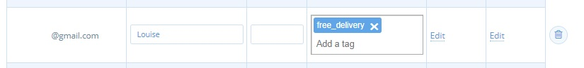
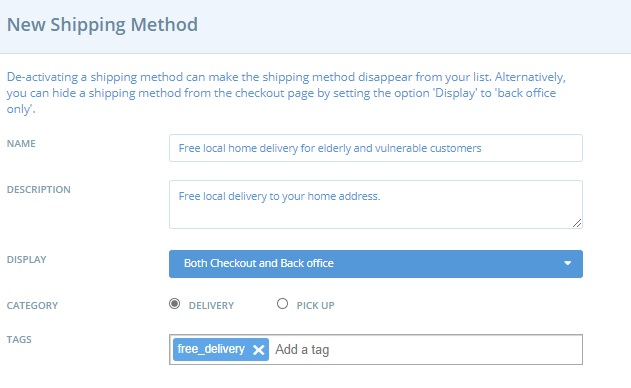
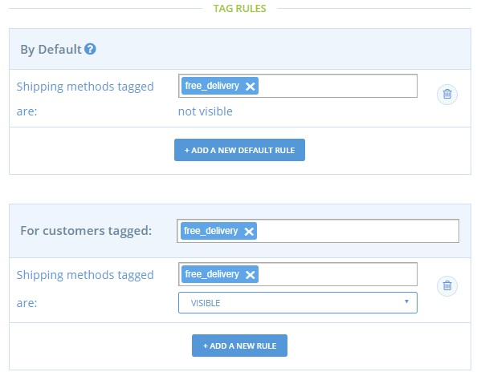

# Discounted/Free Delivery for Vulnerable Customers

## Introduction

Elderly or vulnerable customers may find it more difficult to reach your hub or shop collection point.  Whilst it wouldn't necessarily be possible for you to deliver goods to every customer's doorstep \(due to cost, time and distances involved\) you may have capacity to help a small number of local 'priority' customers.

Below is a step-by-step guide to enable selected customers to access free \(or discounted\) delivery.

The process uses the Customer Management feature which is described in [full here](../../basic-features/shopfront/customer-management-and-conditional-displays-prices/tags-and-tag-rules.md#show-hide-shipping-methods).

## **Things to consider before starting**

* What is the maximum number of delivery slots you can offer for free/discounted rate?
* Which areas would you consider delivering to free of charge or at a discounted rate?  For instance, limit the area to a specific postcode/street/district or perhaps to streets on your way home.
* Be realistic about the number of deliveries you can make and the cost of petrol/time to make them.

## Process

* Keep a record of the customer’s name and the email address linked to their OFN account.
* Login to your business OFN account and visit [Customers](https://openfoodnetwork.org.uk/admin/customers) [page](../../basic-features/shopfront/customer-management-and-conditional-displays-prices/customers.md).
* Use the ‘Quick Search’ box to identify if the person has shopped with you before. 

* If their email address doesn’t appear then click **+ New Customer** and add their address.
* Add the tag ‘free\_delivery’ to the customers entry.

* Visit **Enterprises -&gt; Settings -&gt;** [**Shipping Methods**](../../basic-features/shopfront/shipping-methods.md) and click **+New Shipping Method**.

Name: Free local home delivery for elderly and vulnerable customers.  
Description: Free local delivery to your home address.  
Display: Both Checkout and Back Office  
Category: Delivery  
**Tags: Add the tag ‘free\_delivery’ into this space.**  
Fee Calculator: Flat Rate amount = 0.00  
Categories: Default  
Zones: UK\_VAT

* Visit your **Enterprise -&gt; Settings** page and select ‘[Tag Rules](../../basic-features/shopfront/customer-management-and-conditional-displays-prices/tags-and-tag-rules.md)’ from the left hand menu.  Set up the following Tag rules:

Default: Shipping Methods tagged ‘free\_delivery’ are not visible.  
For Customers tagged ‘free\_delivery’, Shipping Methods tagged ‘free\_delivery’ are visible.

**Bingo!  A customer who has registered with you as elderly and lives close by will have these options at checkout:**

Everyone else will only be able to see your standard shipping methods:


Add a comment to your standard delivery methods \(in the ‘Description box’\) to inform elderly and vulnerable customers on how to get in touch and be eligible for free delivery in the future.


## **You might also like to: Add a message to your customers on your shop Notice page.**

Don’t forget to edit your ‘[Shopfront Message](../../basic-features/enterprise-profile/enterprise-settings.md#shop-preferences)’ \(found from **Enterprises -&gt; Settings -&gt; Shop Preferences**\) to invite new elderly/vulnerable/keyworker customers to contact you so they can be prioritised.

