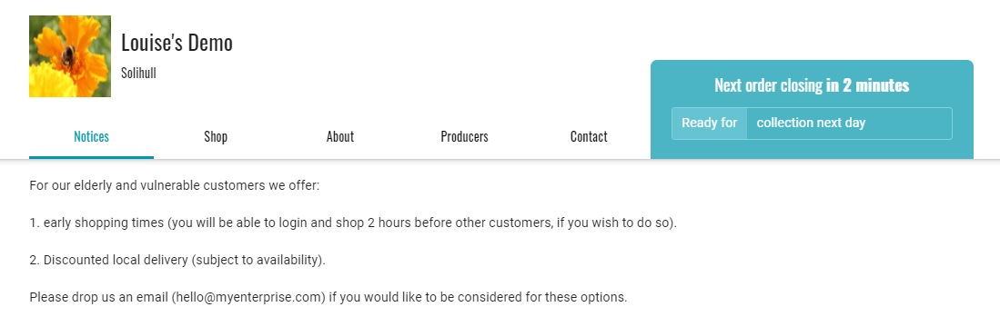

# Horaires d'achat spéciaux pour les groupes prioritaires

## Introduction

L'épidémie de COVID-19 en mars 2020 a donné lieu à une vague d'achats de panique par les consommateurs avant \(ou dans les premiers jours\) des "lockdowns" nationaux. Les groupes vulnérables et les travailleurs clés se sont retrouvés à court de nourriture. 

Vous trouverez ci-dessous un guide étape par étape permettant à des clients sélectionnés \(vous pouvez choisir, en tant qu'entreprise, de ne prendre en compte que les personnes âgées de plus de 80 ans ou d'inclure également les travailleurs clés\) de faire leurs achats avant les autres et d'obtenir ainsi le premier choix de produits \(s'ils venaient à manquer plus tard dans votre cycle de commande\). 

Ce processus utilise la fonction de gestion des clients qui est décrite en détail ici.


Votre entreprise devra être enregistrée en tant que Hub sur la plateforme OFN pour ajouter des étiquettes aux cycles de commande, comme décrit ci-dessous.


## Processus

* Établissez une politique en tant qu'entreprise sur le\(s\) groupe\(s\) auquel\(s\) vous souhaitez offrir ce service. 
* Conservez une trace du nom du client et de l'adresse e-mail liée à son compte OFN. 
* Connectez-vous à votre compte OFN professionnel et visitez la page Clients. 
* Utilisez la case "Recherche rapide" pour déterminer si la personne a déjà fait des achats chez vous.

* Si son adresse électronique n'apparaît pas, cliquez sur **+ Nouveau client** et ajoutez son adresse. 
* Dans la colonne Étiquettes, tapez "priorité" pour ce client.

* Visitez votre page Cycles de commande. Configurez votre prochain cycle de commande comme vous le feriez normalement : les heures d'ouverture et de fermeture étant celles que vous souhaitez offrir à tous les clients.

* Copy this order cycle.  
* Change the name of the copied order cycle by adding the appendix ‘early’. 
* Change the opening time to an hour/day \(your choice\) before that of the normal order cycle and the closing time to that of the opening time for your regular shopping.

À la page 3 du cycle de commande " anticipé ", ajoutez " priorité " dans la section étiquettes :

* Rendez-vous sur la page **Enterprise -&gt; Paramètres** et sélectionnez "Règles d'étiquetage" dans le menu de gauche. Configurez les règles d'étiquetage suivantes :

Par défaut, les cycles de commande étiquetés "prioritaires" ne sont pas visibles. Pour les clients marqués 'priorité', les cycles de commande marqués 'priorité' sont visibles.

**Bingo ! La devanture de votre magasin sera ouverte tôt pour une partie de vos clients seulement.** 


n'oubliez pas que vous devrez notifier à vos fournisseurs les commandes générées dans les deux cycles de commande chaque semaine


## Vous pourriez aussi souhaiter : Ajouter un message à vos clients sur la page d'avis de votre boutique.

N'oubliez pas de modifier votre "message de vitrine" \(disponible dans **Entreprises -&gt; Paramètres -&gt; Préférences** de la boutique\) pour inviter les nouveaux clients âgés/vulnérables/travailleurs à vous contacter afin qu'ils soient prioritaires.

