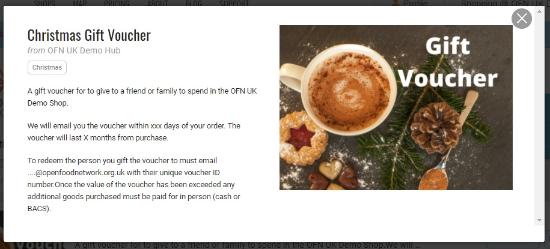
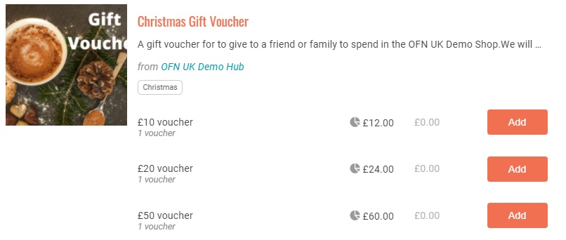
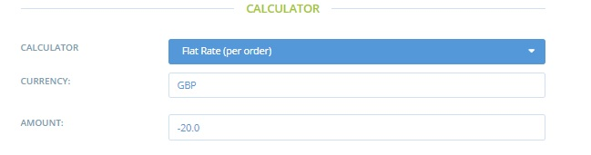

# Wie man Geschenkgutscheine erstellt

## Introduction


Die einfache Implementierung von Geschenkgutscheinen (Verkauf und Einlösung) ist derzeit keine Funktion der OFN-Plattform, obwohl wir hoffen, sie in Zukunft einführen zu können.


In der Zwischenzeit ist es möglich, Gutscheine mit Hilfe von Tags und Tag-Regeln zu erstellen. Der Vorgang wird im Folgenden beschrieben. Gutscheine sind zu Weihnachten und anderen saisonalen Anlässen immer sehr beliebt, und aufgrund der Komplexität der Ausstellung könnte es sich lohnen, Gutscheine nur zu bestimmten Zeiten des Jahres anzubieten.

Eine alternative "Geschenk"-Option, die Ihr Unternehmen in Betracht ziehen könnte, ist die Möglichkeit, dass ein Kunde (der Schenkende) ein [Abonnement](../../basic-features/subscriptions/) (regelmäßige Bestellung) für einen Freund oder ein Familienmitglied (den Beschenkten) abschließt. Zum Beispiel könnte der Schenkende dafür sorgen, dass der Beschenkte einen Monat lang jede Woche sein Lieblingsbrot von Ihrem Lebensmittelunternehmen geliefert bekommt (auf Kosten des Schenkenden).

Dies hätte für den Schenkenden den zusätzlichen Vorteil, dass die Kosten des Geschenks wöchentlich verteilt würden und nicht als Pauschalbetrag gezahlt werden müssten: Zu Weihnachten und in anderen Jahreszeiten ist der Geldfluss für alle knapp!

## Process


Dies ist ein mehrstufiger Prozess


### Schritt eins

Erstellen Sie ein [Produktverzeichnis](../../basic-features/products-1/products.md) für Gutscheine. Wir schlagen vor, dass Sie es einfach halten, d.h. nur maximal drei verschiedene Gutscheinwerte (£10, £20, £50). Denken Sie daran:

* Einfügen von Anweisungen für den Kunden, wie er seinen Gutschein später einlösen kann (Sie müssen den Empfänger des Gutscheins bitten, Ihrem Unternehmen eine E-Mail mit der Gutschein-ID-Nummer (siehe[ Schritt 2](how-to-create-gift-vouchers.md#zweiter-schritt)) und der E-Mail-Adresse ([Schritt 5](how-to-create-gift-vouchers.md#schritt-fuenf)), mit der er ein OFN-Konto eingerichtet hat, zu schicken).

* dass die Unternehmensgebühren im Preis des Gutscheins enthalten sind. Bei der Person, die den Gutschein einlöst, wird die Unternehmensgebühr ebenfalls auf die von ihr gekauften Produkte aufgeschlagen (d. h. die Gebühren werden zweimal erhoben). Die zusätzliche [Unternehmensgebühr](../../basic-features/shopfront/enterprise-fees.md) kann notwendig sein, um die zusätzlichen Verwaltungskosten für die Bearbeitung von Geschenkgutscheinen zu decken. Alternativ kann der Produktpreis so angepasst werden, dass der Wert des Gutscheins dem Preis des Kunden entspricht (Produktpreis + Gebühr).

### Zweiter Schritt

Schicken Sie dem Kunden einen Gutschein per E-Mail oder drucken Sie einen Papiergutschein aus. Geben Sie jedem Gutschein eine eindeutige Nummer (verwenden Sie z. B. die OFN-Bestellnummer mit dem Postfix a, b, c usw., wenn mehrere Gutscheine in derselben Transaktion gekauft wurden).

Beispiel:

Dieser Gutschein wurde mit der kostenlosen Online-Software [Canva](https://www.canva.com/) erstellt.

### Dritter Schritt

Erstellen Sie eine Tabelle, um die Verkäufe zu erfassen und die Forderungen zu verfolgen: Name des Kunden (Schenkenden), Betrag, Ausstellungsdatum, Bestellnummer/Gutschein-ID-Nummer, Name des Empfängers (Beschenkten), Restguthaben.

| Gifter-E-Mail-Adresse            | Wert des Gutscheins         | Datum des Erwerbs | ID-Nummer des Gutscheins | Giftee email address             | Credit remaining |
| -------------------------------- | --------------------------- | ----------------- | ------------------------ | -------------------------------- | ---------------- |
| 
…@gmail.com Joe Bloggs
 | 
£20

R185277652
 | 10/10/20          | JB\_7652a                | 
…@hotmail.com Mr Baker
 | £20              |
|                                  |                             |                   |                          |                                  |                  |
|                                  |                             |                   |                          |                                  |                  |

### Vierter Schritt

Der Kunde, der den Gutschein gekauft hat (Schenker), schenkt ihn zu Weihnachten einem Freund oder Familienmitglied (Beschenkter). Damit der Beschenkte seinen Gutschein einlösen kann, muss er Ihren Hub/Shop kontaktieren und Sie darüber informieren:

* Die mit ihrem OFN-Konto verbundene E-Mail-Adresse (für [Schritt 5](how-to-create-gift-vouchers.md#schritt-fuenf))
* Ihre eindeutige Gutschein-ID-Nummer (damit Sie den Überblick über ausgestellte und eingelöste Gutscheine behalten können).

### Schritt Fünf

Add the giftee to your enterprise [Customer](https://openfoodnetwork.org.uk/admin/customers) list if they have not purchased from the shop in the past. If they have brought before then they will appear on the list already. &#x20;

Fügen Sie den Beschenkten zu Ihrer [Unternehmenskundenliste](https://app.openfoodswitzerland.ch/admin/customers) hinzu, wenn er in der Vergangenheit noch nicht im Shop eingekauft hat. Wenn er schon einmal eingekauft hat, wird er bereits in der Liste erscheinen.

**Fügen Sie eine eindeutige Kennzeichnung neben dem Namen des Kunden hinzu.** Verwenden Sie vielleicht die Initialen und die letzten vier Ziffern der Gutschein-ID-Nummer (legen Sie eine einheitliche Vorgehensweise fest).

### Schritt Sechs

Richten Sie eine NEUE [Zahlungsmethode](../../basic-features/shopfront/payment-methods.md#einrichte-einer-zahlungsmethode) ein, die für diesen Kunden (den Beschenkten) EINZIGARTIG sein wird. Zahlungsarten finden Sie unter **Unternehmen -> Einstellungen -> Zahlungsarten +Neue Zahlungsart**.

Beschreibung - Verwenden Sie das Beschreibungsfeld, um dem Kunden den Wert des Gutscheins zu erklären, den er von seinem Freund/Familie erhalten hat, und dass der Restbetrag der Bestellung gegebenenfalls in bar oder per BACS beglichen werden muss (geben Sie die Bankdaten an, wie Sie dies tun können). Es lohnt sich auch, alle Bedingungen zu erklären - zum Beispiel, dass der Gutschein nur einmalig verwendet werden kann (d.h. wenn der Wert des Gutscheins einmal in Anspruch genommen wurde, wird die zweite Bestellung storniert oder es muss der volle Betrag bezahlt werden) und das Ablaufdatum des Gutscheins.\
Anzeige = Sowohl Kasse als auch Backoffice\
Aktiv = ja\
**Fügen Sie der Zahlungsmethode eine Markierung hinzu (dieselbe wie für den Kunden).**\
Anbieter - Bargeld (wenn der Kunde mehr als den Wert seines Gutscheins ausgibt, muss er den Restbetrag in bar oder per BACS bezahlen)


Verwenden Sie hier keinen automatischen Zahlungsanbieter (Stripe oder PayPal), da dies dazu führt, dass eine Zahlung von Ihrem Unternehmen auf das Bankkonto des Beschenkten erfolgt, wenn dieser weniger als den Gutscheinwert ausgibt.


Honorar-Rechner: Pauschalpreis\
Betrag: Geben Sie den Wert ihres Gutscheins mit einem vorangestellten negativen Vorzeichen ein.

### Schritt Sieben

Richten Sie eine[ Tag-Regel ](../../basic-features/shopfront/customer-management-and-conditional-displays-prices/tags-and-tag-rules.md#zahlungsarten-anzeigen-ausblenden)ein (besuchen Sie **Unternehmen -> Einstellungen -> Tag-Regeln**):

Standard: Zahlungsmethoden mit dem Tag initials\_digits sind nicht sichtbar\
Regel: Für Kunden mit dem Tag initials\_digits sind Zahlungsmethoden mit dem Tag initials\_digits sichtbar.

### Der Kunde (Beschenkte) nutzt den Gutschein und überschreitet den Wert des Restguthabens:&#x20;

* Löschen Sie die eindeutige Zahlungsmethode, die Tag-Regel und das Tag, das mit dem Namen des Kunden (des Beschenkten) verbunden ist.
* den Restbetrag ihrer Bestellung durch Barzahlung oder BACS zu erhalten

### Der Kunde (Beschenkte) nutzt den Gutschein, gibt aber nicht den gesamten Wert aus:&#x20;

Bearbeiten Sie die individuelle Zahlungsmethode, um den "Betrag" unter Gebührenrechner an das verbleibende Guthaben des Gutscheins anzupassen (z. B. wenn der ursprüngliche Wert des Gutscheins 20 £ betrug und Sie 15 £ ausgegeben haben, wäre der ursprüngliche Betrag -20 und der Betrag nach der ersten Transaktion müsste auf -5 geändert werden).\

### Zu beachtende Punkte:

* Wenn ein Kunde (der Beschenkte) einen zweiten Kauf tätigt, bevor Sie die Möglichkeit hatten, sein verbleibendes Guthaben zu aktualisieren oder die einmalige Zahlungsoption zu entfernen (wenn sein Guthaben aufgebraucht ist), hat er die Möglichkeit, den Wert des Gutscheins zweimal zu beanspruchen. Dies setzt voraus, dass der Kunde ehrlich ist und dies nicht tut. Dies sollte auf dem Gutschein und in der Beschreibung der Zahlungsmethode ([Schritt 6](how-to-create-gift-vouchers.md#schritt-sechs)) erwähnt werden. Als Unternehmen können Sie Bestellungen stornieren, wenn ein Gutschein unberechtigterweise eingelöst wird - es ist jedoch immer gut, den Kunden (den Beschenkten) vorher zu informieren!
* Bei Gutscheinen ist es sinnvoll, ein Verfallsdatum festzulegen (z. B. 12 Monate).
