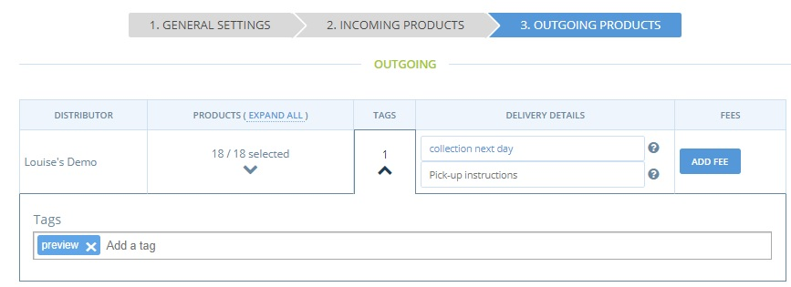
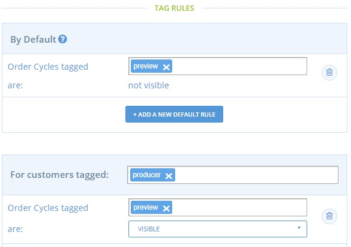
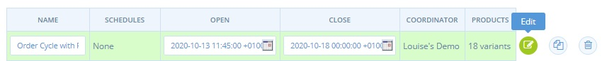

# Öffnen Sie Ihren Shop auf 'Vorschau'.


-->​ Diese Seite ist noch nicht ins Deutsche übersetzt. Wenn du mithelfen möchtest, melde dich gerne bei uns [per E-Mail](mailto:konrad@openfoodnetwork.de) oder [im Slack](https://join.slack.com/t/openfoodnetwork/shared\_invite/zt-9sjkjdlu-r02kUMP1zbrTgUhZhYPF\~A)!


## Introduction

As a hub manager you may often be asked by your suppliers to see what their products look like on your shop front before the order cycle goes 'live' to customers.  Suppliers may wish to tweak their listings- change a photo or add to their product descriptions for example.  This is especially common in the early days (weeks and months) of a new hub.

The process below outlines how to implement a 'Preview' Order Cycle. It draws on the highly flexible feature of Tag and Tag Rules on the OFN platform.


Your enterprise will need to be listed as a Hub on the OFN platform to add a tag to order cycles.


## Process


This is a **TWO** step process:&#x20;

1. Opening an Order Cycle which only you and suppliers can view.
2. Removing the tag which facilitates (1) when the order cycle goes 'live' to customers.


### Step one

* Login to your business OFN account and visit [Customers](https://openfoodnetwork.org.uk/admin/customers) page.
* Click **+ New Customer** and add the email addresses of your suppliers. (If they have placed an order with your shop/hub in the past then they will already be a customer of your enterprise and so this step is not necessary.)
* In the ‘tags’ column type in ‘producer’ for that customer.

* Visit your [Order Cycles](https://openfoodnetwork.org.uk/admin/order\_cycles) page. &#x20;
* Set up your next [order cycle](../../basic-features/shopfront/order-cycle/order-cycles-for-hubs.md). Set the opening time as ‘now’ and the closing time your usual closing time.
* On page 3 (‘Outgoing Products’) add ‘preview’ into the tag section:

* Visit your **Enterprise -> Settings** page and select ‘[Tag Rules](../../basic-features/shopfront/customer-management-and-conditional-displays-prices/tags-and-tag-rules.md#show-hide-order-cycles-at-my-shopfront)’ from the left hand menu.  Set up the following Tag rules:\
  Default: Order Cycles tagged ‘preview’ are not visible.\
  For Customers tagged ‘producer’, Order Cycles tagged ‘preview’ are visible.

**Bingo!  Your order cycle is now open for your producers to view their products on your shop front but general customers will not be able to view (or shop).**


Producers/suppliers can make purchases during this time


### Step Two

* **Set a reminder on your phone/calendar to edit your order cycles at the time and day you wish shopping to commence.**
* At this time visit your [order cycles](https://openfoodnetwork.org.uk/admin/order\_cycles) and select ‘Edit’ next to the one you wish to make ‘live’ to customers:

* Visit ‘Outgoing Products’ section on page 3 and remove the tag:

**All your customers will be able to view your shop and make purchases now!**

###
