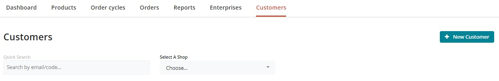

# Reward your volunteers


This functionality can be achieved using either the [Voucher](../../basic-features/shopfront/vouchers.md) or  [Tags and Tag Rules](../../basic-features/shopfront/customer-management-and-conditional-displays-prices/tags-and-tag-rules.md) features of the platform.&#x20;

We recommend using the Tags and Tag Rules feature here for the following reasons:

* Volunteers are often already customers of your shop and so setting the tags up is more straight forward in their case than it for members of the public.
* It prevents a discount voucher code being published and shared online where it could be used by non-volunteers to get money off their shopping.  Equally, if a volunteer stops helping then the tag can be easily removed for them without having to re-issue all your volunteers with a new voucher discount code.
* Only one voucher can be redeemed at a time.  By offering volunteers a discount using tags, they will also be able to redeem a voucher on their reduced price shopping which may be gifted to them at Christmas or birthday by friend/family.


## Introduction

Would you like to say a little thank you to the people who help run your community food enterprise?  One option is to allow staff and volunteers to have a small discount off any shopping they do.  Below is a step-by-step guide on how to implement this.  The process draws on the highly flexible Customer Management tools available using [Tags and Tag Rules](../../basic-features/shopfront/customer-management-and-conditional-displays-prices/tags-and-tag-rules.md).

## Process

* Ask your volunteers to  let you know the email address linked to their OFN account.
* Login to your business OFN account and visit [Customers](https://openfoodnetwork.org.uk/admin/customers) page.
* Use the ‘Quick Search’ box to identify if the person has shopped with you before.&#x20;

* If their email address doesn’t appear then click **+ New Customer** and add their address.
* Add the tag ‘volunteer’ to the customer’s entry.

* Visit **Enterprises -> Settings** and then select ‘[Payment Methods](../../basic-features/shopfront/payment-methods.md)’ from the left hand menu. &#x20;
* Click **+ New Payment** Method.

\
Name: Volunteer 5% Discount\
Description: Thank you for helping us run our local food hub.\
Display: Both Checkout and Back Office\
Active: yes\
**Tags: Add the tag ‘volunteer’ into this space.**\
Provider: choose the most appropriate method for your business.\
Fee Calculator: Flat Percent

* After selecting Create, add ‘-5’ \* to the ‘Amount’ field of the ‘Fee Calculator’ Section.  (Negative sign results in a discount)\
  \
  \*-5 will result in a 5% discount if your enterprise does not use Enterprise Fees.


All **percentage fees** are calculated on a percentage of **product costs** only.&#x20;



If your business adds a flat percent Enterprise Fee to all products then the amount you need to enter into the 'Flat Percent' field for this discount payment method is:

&#x20;$$= (100 + Enterprise Fee)*Desired Discount/100$$&#x20;

eg. for a business with an enterprise fee of 20% who would like to offer a 5% discount to volunteers, the amount to enter in the flat percent of this payment method is:

$$= -(100 + 20) *5/100 = -6$$&#x20;


* Visit your **Enterprise -> Settings** page and select ‘[Tag Rules](../../basic-features/shopfront/customer-management-and-conditional-displays-prices/tags-and-tag-rules.md#show-hide-payment-methods)’ from the left hand menu.  Set up the following Tag rules:

Default: Payment Methods tagged ‘volunteer’ are not visible.\
For customers tagged ‘volunteer’ payment methods tagged ‘volunteer’ are visible.

* When you open an [order cycle](../../basic-features/shopfront/order-cycle/), ensure to select at least two payment methods on Page 4, under 'Checkout Options' - the tagged payment method which offers volunteers a discount and an un-tagged method visible for all customers.

<figure><figcaption></figcaption></figure>

At checkout, this is an example of what a volunteer will view (when logged into their OFN account):

