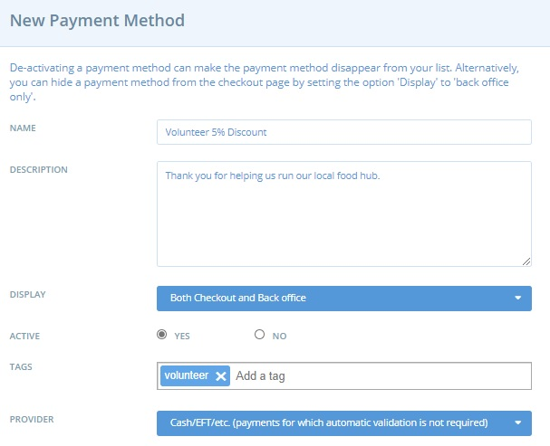
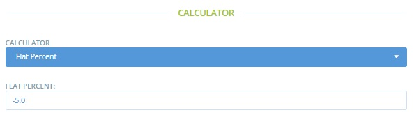
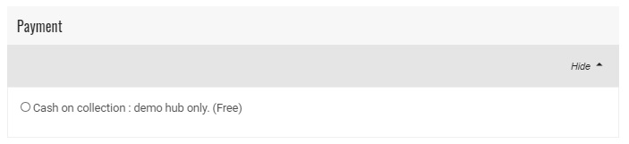

# Tarification sociale / réductions

## Introduction

Vous souhaitez accorder des réductions par exemple, pour remercier les personnes bénévoles qui vous aident à gérer votre entreprise alimentaire communautaire ou encore appliquer une tarification sociale ou une remise ponctuelle ?&#x20;

Vous trouverez ci-dessous un guide sur la façon de mettre en œuvre cette mesure. Le processus s'appuie sur les outils de gestion des clients disponibles grâce aux étiquettes et aux règles d'étiquetage.

## Processus&#x20;

Prenons le cas de réduction à appliquer aux bénévoles de votre organisation

* Demandez à vos bénévoles de vous donner l'adresse électronique liée à leur compte OFN.
* Connectez-vous au compte OFN de votre entreprise et consultez la page Clients.
* Utilisez la case "Recherche rapide" pour déterminer si la personne a déjà fait des achats chez vous.

* Si leur adresse électronique n'apparaît pas, cliquez sur **+ Nouveau client** et ajoutez leur adresse.&#x20;
* Ajoutez l'étiquette " bénévole " à la description du client.

* Allez dans **Entreprises -> Paramètres**, puis sélectionnez " **Modes de paiement** " dans le menu de gauche.&#x20;
* Cliquez sur **+ Nouveau mode de paiement**.

\
Nom : Remise de 5 % pour les bénévoles&#x20;

Description : Merci de nous aider à gérer notre centre alimentaire local.&#x20;

Affichage : Caisse et arrière-boutique&#x20;

Actif : oui&#x20;

**Étiquettes : Ajoutez l'étiquette "bénévole" dans cet espace.**&#x20;

Prestataire : choisissez la méthode la plus appropriée pour votre entreprise.&#x20;

Calculateur de frais : Pourcentage fixe

*   Après avoir sélectionné Créer, ajoutez '-5' \* au champ 'Montant' de la section 'Calculateur de frais'. (Le signe négatif correspond à une réduction).

    \*-5 donne lieu à une remise de 5 % si votre entreprise n'utilise pas les frais d'entreprise.


Tous les **frais en pourcentage** sont calculés sur un pourcentage du **coût des produits** uniquement.



Si votre entreprise ajoute un pourcentage fixe de frais d'entreprise à tous les produits, le montant que vous devez saisir dans le champ "Pourcentage fixe" pour ce mode de paiement est le suivant :

&#x20;$$= (100 + Enterprise Fee)*Desired Discount/100$$&#x20;

Par exemple, pour une entreprise dont les frais d'entreprise s'élèvent à 20 % et qui souhaite offrir une réduction de 5 % aux bénévoles, le montant à saisir dans le pourcentage fixe de ce mode de paiement est le suivant :

$$= -(100 + 20) *5/100 = -6$$&#x20;


* Rendez-vous sur la page **Entreprise -> Paramètres** et sélectionnez "Règles d'étiquetage" dans le menu de gauche. Configurez les règles d'étiquetage suivantes :

Par défaut : Les modes de paiement marqués " bénévole " ne sont pas visibles. Pour les clients marqués " bénévole ", les modes de paiement marqués " bénévole " sont visibles.

**Bingo ! Seuls vos bénévoles pourront bénéficier d'une réduction de 5 % lorsqu'ils feront des achats chez vous.**

