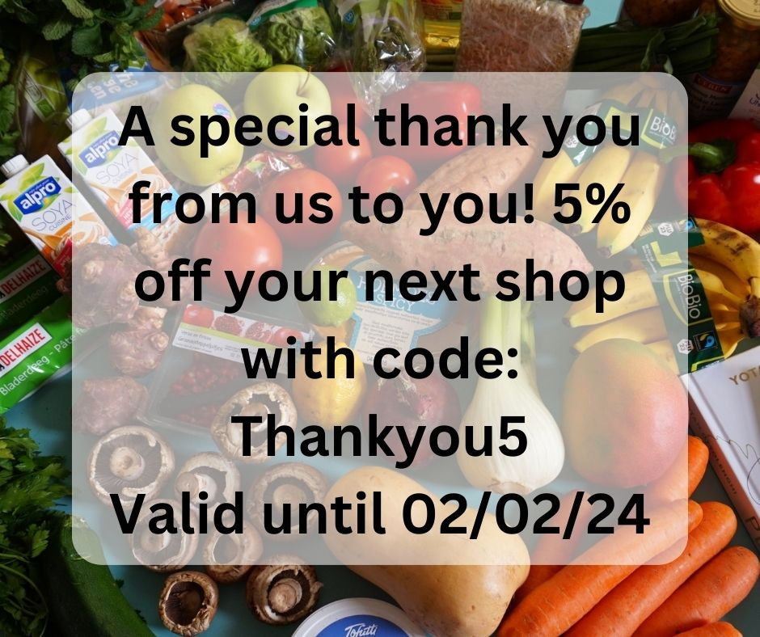

# Running a Social Media Promotion


We recommend using the [Voucher](../../basic-features/shopfront/vouchers.md) functionality of the platform if you wish to offer a discount code to all customers via a social media campaign.



The advantages of voucher codes are:

* There's no need for shoppers to have an OFN account or be existing customers of your shop.
* They are easy for customers to use and easy for hub managers to facilitate.



Limitations which you need to be aware of before starting:

* Voucher codes have no expiry date and so you will need to remember to log into your OFN account and deactivate the voucher at the end of the promotional period to prevent it being used continuously.
* Only one voucher code can be redeemed at a time. Hence a customer wishing to spend their [uniquely-coded money-off gift voucher](how-to-create-gift-vouchers.md) for your food hub will not be able to redeem it alongside this type of percentage discount social media voucher.
* It is not possible to state a minimum spend alongside the voucher code.
* Vouchers can only be redeemed against shopping and not against the cost of shipping.


## Introduction

To retain loyal customers and/or attract new ones you may from time to time like to run a social media promotion.  For example, you might post on Facebook and Instagram that for all orders received in the coming week customers can claim a 5% discount on their shopping with a specific voucher code.

As well as potentially encouraging a higher basket spend during a 'lean' shopping period (for example, after Christmas), these type of social media campaigns can attract new social followers and increase your social media presence.  All this is good for building a strong and sustainable food hub community.

Below is a step-by-step guide to implementing the above example. The process relies on the highly flexible [Tag and Tag](../../basic-features/shopfront/customer-management-and-conditional-displays-prices/tags-and-tag-rules.md#show-hide-payment-methods) rules facility on the OFN platform.  At the end of this page are tips on how to [adapt](running-a-social-media-promotion.md#you-might-also-like-to-consider-rewarding-repeat-customers-with-a-small-discount) this promotional offer.

## Process


This is a TWO step process:

1. [Create a voucher](running-a-social-media-promotion.md#step-one) and publish on social media.
2. At the end of the promotional period, [deactivate the voucher code](running-a-social-media-promotion.md#step-two).


### Step One

* Create a new [voucher ](../../basic-features/shopfront/vouchers.md)by visiting: Enterprises -> Settings -> Vouchers and selecting **+ Add New**

.jpg>)

* Fill out the options as follows:\
  Voucher Code: Opt for something simple without spaces or special characters.\
  Voucher Type: Percentage \
  Amount: the percentage discount you are offering.

<figure><figcaption></figcaption></figure>

* Save the voucher- it will now be live.
* Create your social media posts and publish.  An example might be:

<figure><figcaption></figcaption></figure>

* Set a very important reminder on your phone or in a calendar to deactivate the voucher on the promotion end date.
* Customer's view at checkout:

<figure><figcaption></figcaption></figure>

### Step Two

* On the day you would like your social media promotion to end, visit Enterprises -> Settings -> Vouchers.  With the voucher active it will appear as:

* Deactivate by de-selecting the tick box next to the relevant code and saving your changes.

