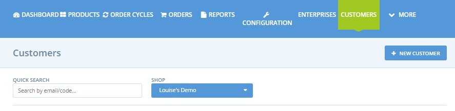

# Running a Social Media Promotion

## Introduction

To retain loyal customers and/or attract new ones you may from time to time like to run a social media promotion.  For example, you might post on Facebook and Instagram that for all orders received in the coming week over the value of £20, customers can claim a 5% discount on their shopping the following week.

Below is a step-by-step guide to implementing the above example. The process relies on the highly flexible [Tag and Tag](../../basic-features/shopfront/customer-management-and-conditional-displays-prices/tags-and-tag-rules.md#show-hide-payment-methods) rules facility on the OFN platform.  At the end of this page are tips on how to [adapt](running-a-social-media-promotion.md#you-might-also-like-to-consider-rewarding-repeat-customers-with-a-small-discount) this promotional offer.

## Process


This is a THREE step process:

1. Identifying eligible customers who purchased above the threshold value.
2. Enabling these customers to get a discount the following week.
3. Removing this discount after one week.


### Step One

* Review your [Orders](https://openfoodnetwork.org.uk/admin/orders) when the current order cycle has closed.  You can identify all the customers who have purchased above the threshold using the following:
  1. Filter by Order Cycle name
  2. Sort by total high to low (click on ‘Total’ twice)

### Step Two

* Visit your [Customers](https://openfoodnetwork.org.uk/admin/customers) page.
* Use the ‘Quick Search’ box to find customers who spent above your threshold on last week’s order cycle.

* Add the tag ‘week2reward’ to the customer’s entry.

* Visit **Enterprises -> Settings** and then select ‘[Payment Methods](../../basic-features/shopfront/payment-methods.md)’ from the left hand menu.  Click **+ New Payment** Method.

.jpg>)

\
Name: Thank you Discount\
Description: a message of your choice (for example ‘As a small thank you for your support we would like to offer you 5% off this week’s shop’)\
Display: Both Checkout and Back Office\
Active: yes\
**Tags: Add the tag ‘week2reward’ into this space.**\
Provider: choose the most appropriate method for your business.\
Fee Calculator: Flat Percent

* After selecting Create, add ‘-5’ \* to the ‘Amount’ field of the ‘Fee Calculator’ Section.  (Negative sign results in a discount)\
  \
  \*-5 will result in a 5% discount if your enterprise does not use Enterprise Fees.


All **percentage fees** are calculated on a percentage of **product costs** only.&#x20;



If your business adds a flat percent Enterprise Fee to all products then the amount you need to enter into the 'Flat Percent' field for this discount payment method is:

&#x20;$$= (100 + Enterprise Fee)*Desired Discount/100$$&#x20;

eg. for a business with an enterprise fee of 20% who would like to offer a 5% discount to volunteers, the amount to enter in the flat percent of this payment method is:

$$= -(100 + 20) *5/100 = -6$$&#x20;


* Visit your **Enterprise -> Settings** page and select ‘[Tag Rules](../../basic-features/shopfront/customer-management-and-conditional-displays-prices/tags-and-tag-rules.md#show-hide-payment-methods)’ from the left hand menu.  Set up the following Tag rules:

Default: Payment Methods tagged ‘week2reward’ are not visible.\
For customers tagged ‘week2reward’ payment methods tagged ‘week2reward’ are visible.

**Bingo!  Only those customers who spent more than your threshold amount last week will be offered a 5% discount when they shop with you this week**

### Step Three

When the order cycle closes, as a hub, you may not want that particular set of customers to be eligible for a 5% discount on their future purchases (ie continue to have a discount for more than one week). In which case you will need to either:

* Remove the ‘week2reward’ tag from all the customer names\
  **Or**
* Change the tag rule to:\
  For Customers tagged ‘week2reward’ Payment Methods tagged ‘week2reward’ are NOT VISIBLE.

## **You might also like to consider rewarding repeat customers with a small discount.**&#x20;

Rewarding only those customers who spend over a threshold amount may exclude those who live on their own or have a more limited household budget.  You may like to run a social media campaign to encourage customer loyalty- whatever the value of their weekly/monthly spends are.

To do this you will need to keep an external record of how often each customer purchases from your OFN shopfront. The [support team in your local instance ](../../local-ofn-organizations-and-contacts.md)maybe able to help compile this data for you. &#x20;

With this information these are some ideas of campaigns you could run:

#### 5% discount off their next order to customers who order x number weeks/order cycles in a row.

In this case you would use the same steps outlined above to tag both the customer and the payment method (with a negative fee calculator) for one order cycle.

#### Free or discounted delivery of their next order to customers who have ordered x number of weeks in a row (akin to buy 3 lots of delivery and get the next free). 

In this case you would tag the customer (say ‘thankyouweek1’) and then create a [shipping method](../../basic-features/shopfront/shipping-methods.md) with the same tag (which was at a discounted rate).&#x20;

The default and complementary tag rules would be:

Default: Shipping Methods tagged thankyouweek1 are NOT VISIBLE\
Rule: For customers tagged thankyouweek1 Shipping Methods tagged thakyouweek1 are VISIBLE\
\
\
\
