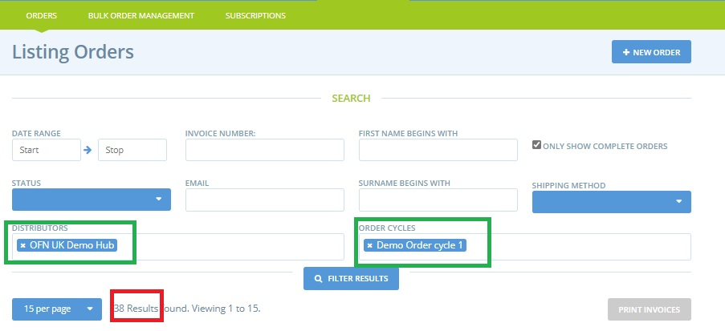
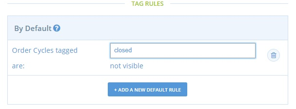
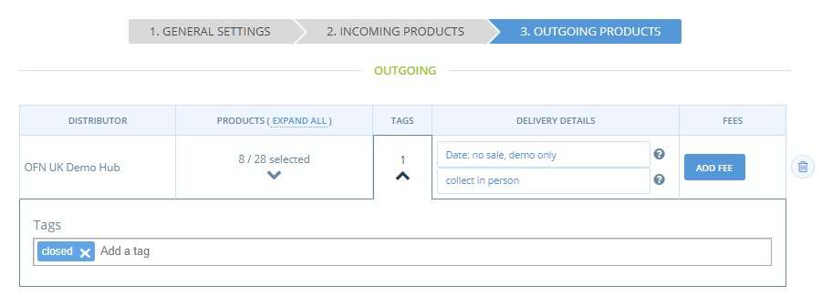

# Soft Close an Order Cycle


--&gt;​ Diese Seite ist noch nicht ins Deutsche übersetzt. Wenn du mithelfen möchtest, melde dich gerne bei uns [per E-Mail](mailto:konrad@openfoodnetwork.de) oder [im Slack](https://join.slack.com/t/openfoodnetwork/shared_invite/zt-9sjkjdlu-r02kUMP1zbrTgUhZhYPF~A)!


From time to time you might find that your enterprise receives more orders than you can physically process \(for example during the panic buying March 2020 or at Christmas\).  


It is always better to know the limits of your business and shut your order cycle early than over sell and then have to let people down. 


Products will disappear from your shop front when their [stock levels move to zero](../../basic-features/products-1/), but there may be a limit to the number of orders you can pack and deliver in the time frame of your shipping methods and this is not accounted for purely by stock \(processing 100 orders, each containing one item will take longer than one order of 100 items\).


Change the end date and time of an [order cycle](../../basic-features/shopfront/order-cycle/) to the current time will mean customers in the process of checking out will not receive their orders.


Therefore we recommend the following method- this way customers who are paying at the time will still have their orders accepted but no others will be taken.

## Process

* Your enterprise can process 100 orders a week- this is a the absolute max.
* Your [listing orders](../../basic-features/orders/view-orders.md#listing-orders) page shows that you have received 95 orders in this order cycle and there are still 2 more days for it to run.


Visit Orders in your admin panel and filter results by distributor and order cycle \(highlighted in green below\). The number of orders received is shown under the 'Filter Results' heading \(highlighted in red\).


* Add a new default [tag rule](../../basic-features/shopfront/customer-management-and-conditional-displays-prices/tags-and-tag-rules.md) by visiting **Enterprises -&gt; Settings -&gt; Tag Rules**. Default: Order cycles tagged '**Closed**' are not visible.

  
No other tag rules are necessary.

* Edit the [order cycle](../../basic-features/shopfront/order-cycle/order-cycles-for-hubs.md) which is open currently and on page 3 \('Outgoing Products'\) add the tag '**Closed**'

**Update** and your order cycle will close without disrupting customers in the process of checking out.


This process is only possible at the moment for enterprises which are registered as hubs.


