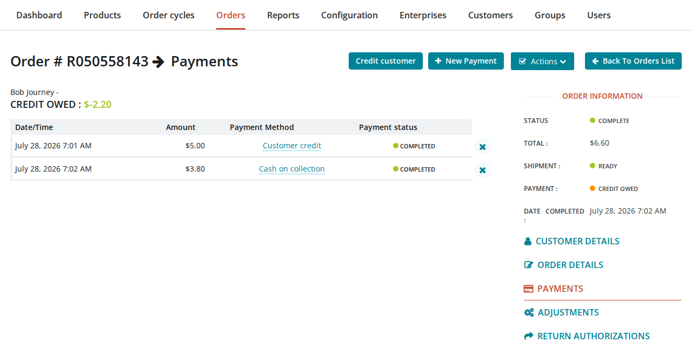
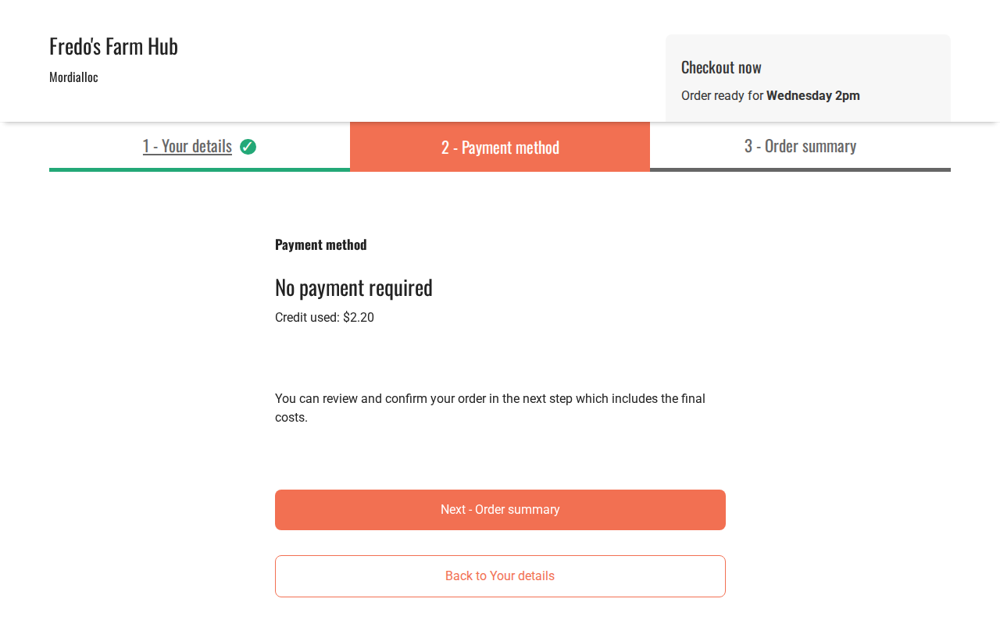
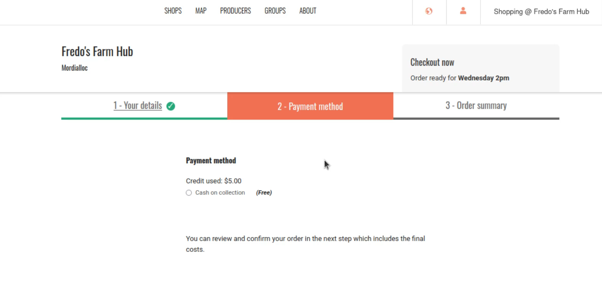
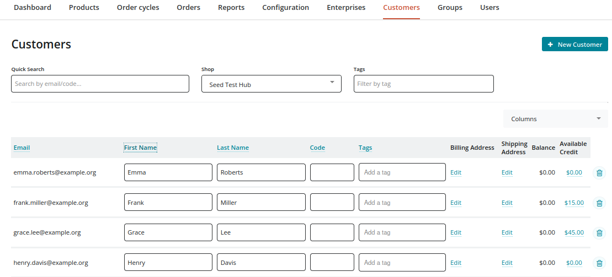
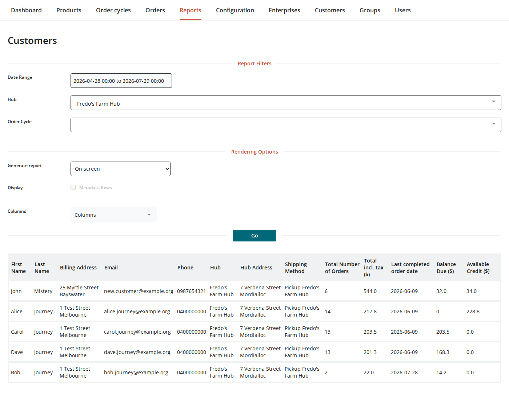
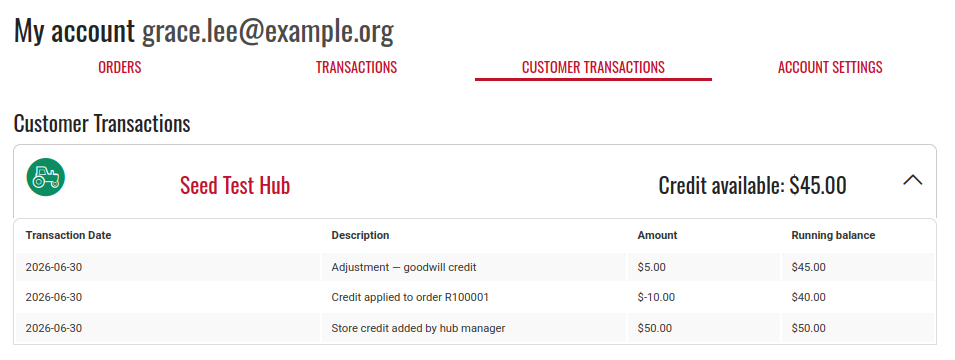

# Take orders on Credit


This page explains how to use OFN's built-in **Customer Credit** feature to let customers pay for orders using a prepaid balance. This replaces the older manual workaround of creating credit products — that method is no longer needed.


## What is Customer Credit?

Customer Credit is a balance held on a customer's account that they can use to pay for future orders at your hub. When a customer has credit, it is applied **automatically** at checkout — no action is needed from you or the customer.

Customer Credit is useful when:

* A customer has overpaid or returned goods and you want to issue store credit instead of a cash refund
* You run a prepaid account scheme where customers top up in advance
* You want to offer goodwill credit after an issue with an order

## How credit works

Each time credit is added or used, a **Customer Account Transaction** is recorded. This is an immutable ledger entry with an amount and a running balance. The running balance is never recalculated — new entries are appended, and the most recent entry represents the customer's current available credit.

Credit can be added to a customer's account in three ways:

* **Bulk credit** from the Orders list (select orders → Actions → Credit orders)
* **Credit customer button** on a "Credit Owed" order (Payments tab → Credit customer)
* **API** for integrations with external systems (POST /api/v1/customer\_account\_transaction)

## Adding credit to a customer's account

### Bulk credit from the Orders list

The quickest method when you have several orders in **Credit Owed** state:

1. Go to **Orders** in your admin menu.
2. Tick the checkbox next to each **Credit Owed** order you want to credit.
3. From the **Actions** dropdown, select **Credit orders**.

Each selected order's owed amount is moved to that customer's credit balance, and the order moves to **Paid** state. You don't enter an amount — OFN uses the amount owed on each order.


Only orders in **Credit Owed** state can be credited. If you select an order that isn't, OFN shows an error for that order and leaves it unchanged; the other selected orders are still credited.


<figure><figcaption>
Orders list with a Credit Owed order selected and the Actions menu showing 'Credit orders'
</figcaption></figure>

### From a "Credit Owed" order

When an order is in "Credit Owed" state — for example, after removing items from a paid order — you can transfer the owed amount to the customer's credit balance:

1. Go to **Orders** and open the order.
2. Click the **Payments** tab.
3. Click the **Credit customer** button.
4. A negative "Customer Credit" payment is created, and the order moves to **Paid** state.

The credit is reflected immediately in the customer's account.


Crediting a customer from an order gives them the flexibility to use that credit toward a future order, rather than processing a refund to their original payment method.


<figure><figcaption>
Payments tab of a Credit Owed order, showing the 'Credit customer' button
</figcaption></figure>

### Using the API

If your hub integrates with external systems (point-of-sale, accounting software), you can add credit via the Customer Account Transaction API:

1. Go to your OFN instance's API documentation at `/api-docs/`.
2. Authorize using your API key (found in your user settings).
3. Use the `POST /api/v1/customer_account_transaction` endpoint.
4. Provide the `customer_id`, `amount` (positive value), and an optional `description`.

The API returns a 201 response with the transaction details, including the new balance.

## How customers use credit at checkout

When a customer with available credit places a new order, their credit is applied automatically during checkout. Here's how it works:



### Full credit coverage

If the customer's credit covers the full order total:

1. At the payment step, the customer sees a **"No payment required"** message with the credit amount.
2. They are not offered a choice of payment method.
3. At the summary step, a credit line appears and the total is $0.00.

<figure><figcaption>
Checkout payment step showing 'No payment required' and the credit used
</figcaption></figure>

### Partial credit coverage

If the customer's credit only partially covers the order:

1. At the payment step, the customer sees "Credit used: $X.XX" and selects a payment method for the remaining balance.
2. At the summary step, a credit line appears alongside the remaining amount.

<figure><figcaption>
Checkout payment step showing the credit used, with a payment method to choose for the rest.
</figcaption></figure>


If the order total is less than the available credit, the remaining credit stays in the customer's account for future orders. It is not consumed beyond what the order requires.


## No payment method to set up

You don't need to create a payment method for Customer Credit or add one to your order cycles. Credit is applied automatically at checkout for any customer who has it, and customers never select it themselves.


Earlier versions of this page described creating a manual "Pay by Credit" payment method and a credit product. Those are no longer needed. A manual "Pay by Credit" method will still appear at checkout as an ordinary payment option, so you may want to remove it from your order cycles' **Checkout options**, or delete it, to avoid confusing customers.


## Checking credit balances

### Customers tab

The **Customers** page (`/admin/customers`) has an **Available Credit** column. If it's not visible, use the **Columns** dropdown to enable it. Clicking any amount opens the transaction history for that customer.

<figure><figcaption>
Customers page showing the Available Credit column
</figcaption></figure>

### Customers report

The **Customers report** (`/admin/reports/customers`) includes two columns relevant to credit:

* **Balance Due** — the total outstanding amount the customer owes across their orders
* **Available Credit** — the credit balance currently in the customer's account

Use these together to get a clear picture of each customer's financial position.

<figure><figcaption>
Customers report showing the Balance Due and Available Credit columns
</figcaption></figure>

### Customer account (customer-facing)

Customers can view their own credit balance:

1. Log in to their OFN account.
2. Go to their account page.
3. Click the **Customer Transactions** tab.
4. They see a list of shops where they have credit, with individual transaction details.

<figure><figcaption>
Customer Transactions tab in the customer's account, showing transaction history and running balance
</figcaption></figure>

## Managing credit payments

### Viewing credit payments

Customer Credit payments appear in the **Payments** tab of an order like any other payment. They are labelled with the payment method "Customer Credit".


Customer Credit and API Customer Credit are internal payment methods. They are available to all distributors automatically and should not be edited by users. They are hidden from screens where other payment methods are managed.


<figure><figcaption>
Payments tab showing Customer credit payments alongside a voided Cash on collection payment
</figcaption></figure>

### Voiding credit payments

If you void a Customer Credit payment on an order, the credited amount is automatically returned to the customer's account balance. Use the void icon on the payment row in the Payments tab.

Voiding also removes the payment from the order, so the order will show **Balance Due** for that amount. OFN doesn't re-apply the credit automatically, so collect the balance another way if the customer still owes it.


Voiding a Customer Credit payment returns the credit to the customer's account — it does not delete the transaction. The ledger entry remains, but a new entry is added reversing the amount


### Entering orders for customers with credit

When you create a new admin order for a customer who has credit, you may encounter an issue with the Payments tab.

Clicking the Payments tab may redirect to the Customer Details tab with the message: "Please fill in the customer details before proceeding to payment." This is misleading — the customer details are already filled in. The real cause is that the order is in "cart" state.

**Workaround:** Click **"Update and Recalculate Fees"** before clicking Payments. This advances the order state and makes the Payments tab accessible directly.


This is a known issue. See the [community forum thread](https://community.openfoodnetwork.org/t/ux-issue-payments-tab-redirects-hub-managers-entering-orders-for-customers-with-credit/3977) for status and updates.


## Key things to remember

* **Customer Credit is automatic** — when a customer checks out, their credit is applied without any action from you.
* **Voiding returns credit** — if you void a Customer Credit payment, the credit goes back to the customer's account and the order shows Balance Due for that amount.
* **No negative credit** — credit cannot go below zero. If an order costs more than the customer's credit, they pay the remainder by another method.
* **Credit vs Credit Owed** — Customer Credit is a balance on the customer's account. Credit Owed is a state on an individual order indicating money is owed back to the customer.
