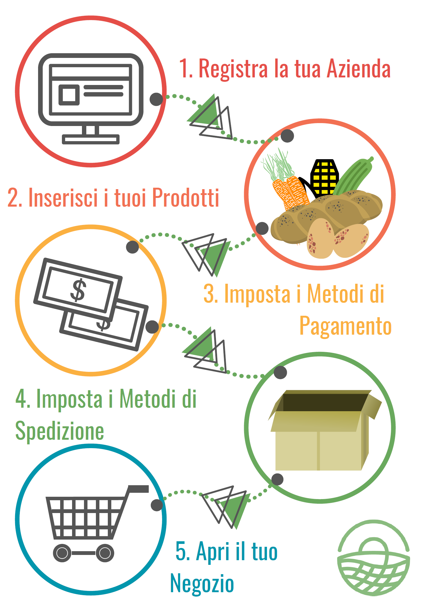

# Hub

Iniziare ad usare OFN è semplice, basta attuare i seguenti passaggi:

1. [Registra il tuo profilo aziendale](../basic-features/register-and-create-your-profile.md).  Se hai intenzione di vendere sia i tuoi prodotti che quelli di altri produttori, allora scegli le[ opzioni](../basic-features/enterprise-profile/package-types.md) "Produttore" e poi "Hub"; se invece hai intenzione di vendere solo prodotti di altri produttori, scegli le opzioni "Non-Produttore" e poi "Hub" Completa le tue [impostazioni dell'azienda](../basic-features/enterprise-profile/enterprise-settings.md) con i dettagli richiesti.
2. Inserisci i tuoi prodotti.  Se sei un 'Hub Produttore' allora [crea](../basic-features/products-1/products.md) \(o [importa](../basic-features/products-1/product-and-inventory-import.md#1-import-new-products)\) il listino dei tuoi prodotti. Sia per Hub 'Produttore' che 'Non-Produttore', contatta le aziende locali i cui prodotti vorresti vendere nel tuo Hub. Chiedi loro di impostare [permessi dell'Azienda](../basic-features/enterprise-profile/enterprise-to-enterprise-permissions-e2es.md) per collegare i vostri profili aziendali su OFN. 
3. Imposta i [metodi di pagamento](../basic-features/shopfront/payment-methods.md) disponibili per i tuoi clienti \(in contanti alla consegna, bonifico, pagamento online con carta di credito, ecc.\) 
4. Imposta i [metodi di spedizione](../basic-features/shopfront/shipping-methods.md) disponibili per i tuoi clienti \(ritiro in luogo ed orario definito; consegna a domicilio, ecc.\) 
5. Imposta un [ciclo di richieste](../basic-features/shopfront/order-cycle/order-cycles-for-hubs.md) : così il tuo negozio aprirà alla data di inizio da te definita! Un ciclo di richieste è un periodo durante il quale i consumatori possono richiedere i prodotti che saranno consegnati o ritirati in un momento stabilito. Alcuni Hub hanno un ciclo di richieste settimanale. Alcuni hanno un ciclo di richieste sempre aperto.

Congratulazioni! Il tuo Hub è ora attivo!


Per applicare un piccolo ricarico al prezzo di vendita per coprire i costi organizzativi, puoi aggiungere una [Tariffa aziendale](../basic-features/shopfront/enterprise-fees.md)'- questo importo sarà sommato al prezzo di vendita dei prodotti nella tua vetrina. 


Quando inizi a ricevere gentili richieste, puoi gestirle nella sezione [gentili richieste](../basic-features/orders/).  

Tutti i dati di cui hai bisogno per preparare e consegnare i tuoi prodotti possono essere consultati nella sezione [report](../basic-features/reports.md).

## Funzionalità più avanzate che potrebbero servirti

* Il tuo profilo aziendale:
  * Da **Hub Produttore** puoi dare ad altri hub locali il [permesso ](../basic-features/enterprise-profile/enterprise-to-enterprise-permissions-e2es.md)di vendere i tuoi prodotti anche nel suo negozio oltre che nel tuo.
  * Puoi [aggiungere gestori](../basic-features/enterprise-profile/transfer-ownership.md) al tuo hub per condividere i compiti amministrativi!
* I tuoi prodotti \(solo per **Hub Produttori**\): 
  * Puoi specificarne particolari caratteristiche [caratteristiche](../basic-features/products-1/product-properties.md) \(es. BIO, plastic free, ecc...\)
  * Se un prodotto può essere venduto in diverse forme \(es. patate in confezioni da 500g, 1kg e 2 kg\), puoi semplificare il tuo listino aggiungendo [varianti](../basic-features/products-1/product-variants.md).
  * Se vendi prodotti con peso e dunque prezzo variabile come carne o ortaggi di grossa taglia \(es. un pollo intero, una zucca, ecc.\), puoi imparare a gestirli [qui.](../basic-features/products-1/pricing-irregular-items-kg.md)
  * Puoi [importare](../basic-features/products-1/product-and-inventory-import.md#1-import-new-products) il tuo listino completo se è in formato Excel.
* La tua vetrina:
  * Puoi [limitare l'accesso](../basic-features/shopfront/private-shopfront.md) al tuo negozio se vuoi che sia accessibile solo ai "soci" o ad utenti invitati. Per esempio potresti offrire prodotti scontati ai membri della comunità che hanno svolto lavoro volontario per te, oppure potresti voler vendere solo a determinati clienti commerciali.
  * Puoi proporre prezzi differenziati, o mostrare prodotti differenziati, a specifici gruppi di utenti, utilizzando le funzioni di [raggruppamento utenti \(tramite "etichette"\)](../basic-features/shopfront/customer-management-and-conditional-displays-prices/tags-and-tag-rules.md) e [personalizzazione visualizzazione e prezzi](../basic-features/shopfront/customer-management-and-conditional-displays-prices/).
  * Se vuoi solo essere visibile su OFN, senza vendere i tuoi prodotti attraverso la piattaforma, puoi impostare una [vetrina di sola visualizzazione](../basic-features/shopfront/display-only-order-cycles.md).

