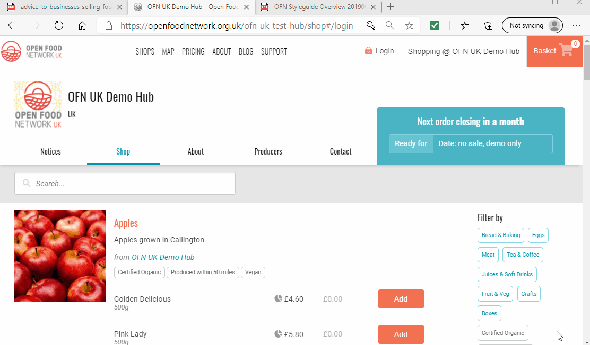

# Häufig gestellte Fragen

### Kann ich meine Bestellung ändern?

Der beste Weg, Ihre Bestellung zu ändern, ist, sich mit dem Geschäft in Verbindung zu setzen, bei dem Sie gekauft haben. Die E-Mail-Adresse und Telefonnummer finden Sie auf der Registerkarte "[Kontakte](the-people-and-businesses-who-make-grow-your-food.md#kontakt)".

Wenn Sie Ihre Einkäufe per Barzahlung bei Abholung oder per Banküberweisung an das Unternehmen bezahlen, können Sie Ihren Warenkorb für einen begrenzten Zeitraum selbst über Ihr Konto bearbeiten. Dazu müssen Sie [ein Konto bei OFN ](your-ofn-account.md)haben.

Wenn Sie die Registerkarte "Bestellungen" in Ihrem Konto aufrufen, erscheint sie wie folgt:

Wenn Sie auf "Bearbeiten" neben der betreffenden Bestellung klicken, erhalten Sie eine Zusammenfassung der Bestellung. Hier können Sie die Menge der einzelnen Artikel ändern oder ein unerwünschtes Produkt ganz löschen.


Sie können jedoch keine weiteren Produkte in diesen Warenkorb legen.&#x20;


**ABER Sie können natürlich zusätzliche Artikel kaufen** - wie oft gehen wir alle in ein Geschäft und nehmen alles mit, außer dem Artikel, den wir kaufen wollten?!

Besuchen Sie den Shop einfach noch einmal und fügen Sie die lebenswichtige Milch/Brot/Butter hinzu, die Sie bei Ihrer ersten Bestellung vergessen haben, und gehen Sie wie [gewohnt zur Kasse](shopping-and-placing-an-order.md).

Wenn Ihr Geschäft vor Ort eine kleine Pauschalgebühr pro Bestellung für die Lieferung/Abholung erhebt, setzen Sie sich mit ihm in Verbindung (E-Mail und Telefonnummer finden Sie unter "[Kontakt](the-people-and-businesses-who-make-grow-your-food.md#kontakt)"). Dort kann man Ihnen diese Gebühr für Ihre zweite Bestellung abnehmen, so dass Sie nicht zweimal zahlen müssen!

### Ich kann nicht an Ort A und zu Zeit B abholen, gibt es einen anderen Ort/Zeitpunkt, an dem ich meine Einkäufe abholen kann?

Wenn Sie eine Frage zum Abhol- oder Lieferservice des Unternehmens haben, bei dem Sie einkaufen möchten, setzen Sie sich am besten direkt mit ihm in Verbindung. Die Kontaktdaten (E-Mail und Telefonnummer) finden Sie unter der Registerkarte "[Kontakte](the-people-and-businesses-who-make-grow-your-food.md#kontakt)" auf der Startseite des Shops.


Nachfragen lohnt sich immer! Wenn es genügend andere Kunden gibt, die eine andere Liefer- oder Abholzeit/einen anderen Ort wünschen, kann Ihr lokales Lebensmittelunternehmen dies vielleicht anbieten.


### Liefern Sie nach...?

Wenn Sie eine Frage zum Abhol- oder Lieferservice des Unternehmens haben, bei dem Sie einkaufen möchten, setzen Sie sich am besten direkt mit ihm in Verbindung. Die Kontaktdaten (E-Mail und Telefonnummer) finden Sie unter der Registerkarte "[Kontakte](the-people-and-businesses-who-make-grow-your-food.md#kontakt)" auf der Startseite des Shops.


Nachfragen lohnt sich immer! Wenn es genügend andere Kunden gibt, die eine andere Liefer- oder Abholzeit/einen anderen Ort wünschen, kann Ihr lokales Lebensmittelunternehmen dies vielleicht anbieten.


### Haben Sie X auf Lager?

Wenn Sie eine Frage zu einem bestimmten Produkt haben, das Sie kaufen möchten, setzen Sie sich am besten direkt mit Ihrem örtlichen Geschäft in Verbindung. Die Kontaktdaten (E-Mail und Telefonnummer) finden Sie unter der Registerkarte "[Kontakte](the-people-and-businesses-who-make-grow-your-food.md#kontakt)" auf der Startseite des Shops.


Nachfragen lohnt sich immer! Es kann durchaus sein, dass es in Ihrer Gegend andere Kunden gibt, die dasselbe Produkt im Laden kaufen wollen oder auch suchen. Wenn die Verantwortlichen des örtlichen Lebensmittelunternehmens Bescheid wissen, können sie sich darum bemühen, einen lokalen, nachhaltigen und qualitativ hochwertigen Lieferanten für diesen Artikel zu finden.


### Ich habe das Passwort für mein OFN-Konto vergessen.

Wenn Sie Ihr OFN-Kontopasswort vergessen haben, wählen Sie "Passwort vergessen?" aus dem Pop-up-Fenster, nachdem Sie auf "Login" geklickt haben (oben rechts auf dem Bildschirm).

Daraufhin wird eine E-Mail an die mit Ihrem OFN-Konto verknüpfte Adresse gesendet. Wenn Sie keine E-Mail mit einem Link zum Zurücksetzen Ihres Passworts erhalten, versuchen Sie bitte diese Schritte:

* in Ihrem Spam- oder Junk-Ordner nachsehen.
* Fügen Sie "openfoodnetwork.org" zu Ihrer Liste der sicheren oder vertrauenswürdigen E-Mail-Programme hinzu.

Ein Großteil der Inhalte im Internet ist Spam. E-Mail-Programme verwenden Filter, um zu verhindern, dass diese unerwünschten E-Mails Sie erreichen. Gelegentlich blockieren sie auch E-Mails, die Sie gerne erhalten würden, wie z. B. die des Open Food Network. Wenn die oben genannten Schritte nicht funktionieren, wenden Sie sich bitte an Ihr [lokales OFN-Supportteam](../local-ofn-organizations-and-contacts.md). Dort wird man Ihnen helfen können.

### Wie kann ich das Passwort für mein OFN-Konto ändern?

Sobald Sie sich in Ihr OFN-Konto eingeloggt haben, können Sie Ihr Passwort jederzeit unter "[Kontoeinstellungen](your-ofn-account.md#kontoeinstellungen)" aktualisieren oder zurücksetzen.

### Ich habe keine E-Mail zur Bestätigung meines Kontos oder meiner Bestellung erhalten.

Ein Großteil der Inhalte im Internet ist Spam. E-Mail-Programme verwenden Filter, um zu verhindern, dass diese unerwünschten E-Mails Sie erreichen. Gelegentlich blockieren sie auch E-Mails, die Sie gerne erhalten würden, wie z. B. die des Open Food Network.

Wenn Sie sich gerade für ein [OFN-Konto](your-ofn-account.md#registrierung-fuer-ein-konto) angemeldet haben (und auf Ihre Kontobestätigungs-E-Mail warten) oder gerade eine[ Bestellung aufgegeben](shopping-and-placing-an-order.md#kasse) haben (und auf Ihre Bestellbestätigungs-E-Mail warten), dann überprüfen Sie Ihren Junk- oder Spam-Ordner, um zu sehen, ob die E-Mail dorthin umgeleitet wurde.

Wenn Sie die E-Mail nicht finden können, wenden Sie sich bitte an [Ihr örtliches OFN-Supportteam.](../local-ofn-organizations-and-contacts.md) Dort wird man Ihnen helfen können.

Um zu verhindern, dass in Zukunft weitere E-Mails blockiert werden, können Sie "openfoodnetwork.org" zu Ihrer "sicheren" oder "vertrauenswürdigen" Liste in Ihrem E-Mail-Programm hinzufügen.

### Was bedeutet 'Bulk'?

Einige Produkte können oben rechts auf dem Foto mit dem Hinweis "Bulk" versehen sein. Das bedeutet, dass der Shop, bei dem Sie einkaufen, diese Produkte nur liefern kann, wenn ein Mindestbestellwert für alle Bestellungen erreicht wird.

Sie werden aufgefordert, eine Mindest- und eine Höchstmenge des Produkts einzugeben, das Sie kaufen möchten. Die "Mindestmenge" ist die Menge, die Sie im Idealfall kaufen möchten. Wenn Sie die "Höchstmenge" höher als die Mindestmenge einstellen, erklären Sie sich bereit, etwas mehr zu kaufen, wenn dies bedeutet, dass das Geschäft eine Großbestellung aufgeben kann und jeder etwas von dem bekommt, was er möchte.

Großeinkäufe sind in den Geschäften von Einkaufsgemeinschaften üblich. [Wenden Sie sich an das Geschäft](the-people-and-businesses-who-make-grow-your-food.md#kontakt), bei dem Sie einkaufen möchten, um weitere Informationen darüber zu erhalten, wie dieser Service funktioniert und welche Vorteile er Ihnen und anderen in Ihrer Gemeinde bringen kann.

### Ich möchte eine große Anzahl desselben Produkts bestellen.

Wenn Sie eine größere Menge eines Produkts kaufen möchten, legen Sie es in Ihren Warenkorb, indem Sie auf die orangefarbene Schaltfläche "Hinzufügen" klicken. Klicken Sie dann auf Ihr Warenkorbsymbol und wählen Sie "[Warenkorb bearbeiten](shopping-and-placing-an-order.md#lokal-einkaufen-leicht-gemacht)". Von hier aus können Sie eine Zahl in das Mengenfeld eingeben und auf "Aktualisieren" klicken.

### Sind alle Artikel, die ich sehe, auf Lager?

Ja. Nur Artikel, die vorrätig sind, erscheinen in der Shop-Liste. Wenn Sie versuchen, mehr als den verfügbaren Lagerbestand in Ihren Warenkorb zu legen, werden Sie daran gehindert.

### Kann ich nicht vorrätige Artikel einsehen?

Nein. Wenn Sie ein Produkt suchen, das Sie letzte Woche gekauft haben, es aber diese Woche nicht finden können, ist es möglicherweise nicht mehr vorrätig. Saisonale Produkte aus lokalem Anbau sind nur so lange vorrätig, wie es die Natur vorgibt. Das bedeutet, dass sich die angebotenen Produkte im Laufe des Jahres ändern können. Wenden Sie sich am besten an das Geschäft, bei dem Sie einkaufen, um herauszufinden, warum ein Artikel nicht verfügbar ist und wann er voraussichtlich wieder auf Lager sein wird.

### Wird mein Einkaufskorb gespeichert, wenn ich weggerufen werde und meinen Einkauf nicht in einem Zug erledigen kann?

Wenn Sie sich in Ihr [OFN-Konto](your-ofn-account.md) eingeloggt haben, bevor Sie mit dem Einkaufen begonnen haben, bleiben die Artikel in Ihrem Einkaufskorb, so dass Sie jederzeit zurückkommen können, um Ihren Einkauf abzuschließen, falls Sie während des Einkaufs abgerufen werden.


Die Produkte in Ihrem Warenkorb sind nicht für Sie selbst reserviert. Wenn ein Artikel nur begrenzt vorrätig ist, wird er den ersten Kunden zugewiesen, die diesen Artikel bestellen.\
Es kann vorkommen, dass Sie zur Kasse gehen und feststellen, dass einer der Artikel, den Sie kaufen wollten, nicht mehr vorrätig ist, bevor Sie ihn in den Warenkorb gelegt haben.


### Ich habe Probleme beim Bezahlen: Die Schaltfläche "Jetzt bestellen" ist inaktiv.

Wenn Sie an der Kasse angekommen sind und alle relevanten Felder ausgefüllt haben, um Ihre Bestellung abzuschließen, aber nach dem Klicken auf die Schaltfläche "Jetzt bestellen" keine Bestellbestätigung angezeigt wird, sollten Sie einige Dinge überprüfen:

* Damit der OFN-Shop auf Ihrem Browser mit den Seiten der Zahlungsanbieter (z.B. Paypal, Stripe) und der OFN-Datenbank "kommunizieren" kann, müssen Sie "**Cookies" akzeptieren**. Führen Sie die [hier](https://www.aboutcookies.org.uk/managing-cookies) beschriebenen Schritte aus, um zu überprüfen, ob Sie die mit openfoodnetwork verbundenen Cookies aktiviert haben. Sie können auch versuchen, alle Cookies, die Sie für unsere Plattform haben, zu löschen, Ihren Browser zu aktualisieren und sie dann wieder zu akzeptieren (das Cookies-Banner mit der grünen Schaltfläche "Cookies akzeptieren" sollte erscheinen, wenn Sie dies tun).
* Gelegentlich können sehr hohe Sicherheitseinstellungen in Ihrem Browser alle Zahlungen im Online-Handel verhindern. Gehen Sie in die Einstellungen Ihres Browsers und verringern Sie die Sicherheitsstufe um eine Stufe, aktualisieren Sie die Seite und versuchen Sie erneut zu bezahlen.

Wenn keiner dieser Schritte funktioniert, wenden Sie sich an das [OFN-Supportteam](../local-ofn-organizations-and-contacts.md) in Ihrem Land.


Wir werden uns bemühen, Ihnen so schnell wie möglich bei Ihrer Bestellung zu helfen. Wir wissen, wie wichtig eine Quelle nachhaltig produzierter, lokaler, frischer Lebensmittel für Ihre körperliche Gesundheit und Ihr geistiges Wohlbefinden ist.


### Es heißt: "Nur zugelassene Kunden können auf diesen Shop zugreifen". Was soll das bedeuten?

Vielleicht hat Ihnen ein Freund empfohlen, ein lokales Geschäft auf der OFN-Plattform zu besuchen, aber wenn Sie auf der Seite landen, sehen Sie diesen Hinweis:

Einige Geschäfte haben sich dafür entschieden, eine "Nur-Mitglieder"-Politik zu betreiben. So können sich z. B. örtliche Einkaufsgemeinschaften oder eine Gruppe von Freunden und Nachbarn zusammenschließen, um bei Großhändlern Großeinkäufe mit einem Rabatt zu tätigen. Oft sind diese Geschäfte bereit, neue Mitglieder aufzunehmen. Sie können eine kleine Gebühr verlangen, um die Verwaltungskosten ihres Geschäfts zu decken, oder Sie fragen, ob Sie bereit sind, bei Lieferungen/Abholungen zu helfen.

[Wenden Sie sich per E-Mail oder Telefon](the-people-and-businesses-who-make-grow-your-food.md#kontakt) an die Verantwortlichen des Unternehmens (unter der Registerkarte "Kontakt"), um zu erfahren, wie Sie Mitglied werden können.

### Es heißt 'Bestellungen sind geschlossen'. Was bedeutet das?

Das Schöne am Kauf bei lokalen Kleinerzeugern ist, dass Sie wissen, dass die Lebensmittel, die Sie bestellen, speziell für Sie von einer echten Person hergestellt/geerntet/verpackt werden, die nicht allzu weit entfernt wohnt.

Damit Ihre örtlichen Bäcker, Landwirte, Metzger, Floristen usw. die Bestellungen vorbereiten können, schließen die Geschäfte oft ein oder zwei Tage vor der Abholung.\
Sie können sich mit dem Geschäft in Verbindung setzen (Details finden Sie unter der Registerkarte "[Kontakt](the-people-and-businesses-who-make-grow-your-food.md#kontakt)"), um zu erfahren, wann es wieder geöffnet ist.

