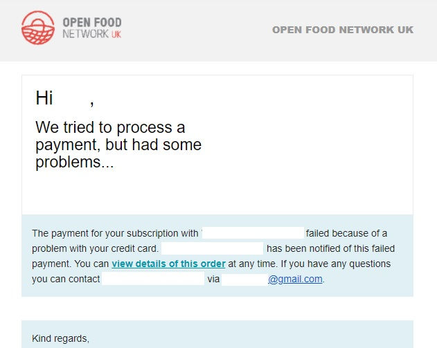
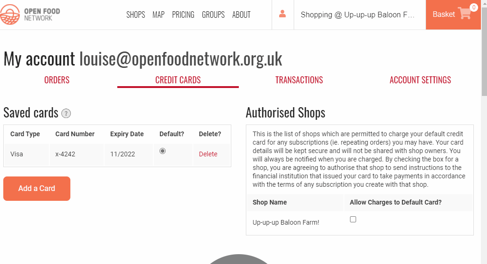

# Regelmäßige automatisierte Bestellungen

## Was sind "Abonnements"?

Abonnements" sind ein Service, der von einigen Geschäften auf der OFN-Plattform angeboten wird. Wenn Sie als Kunde ein "Abonnement" bei einem Geschäft abgeschlossen haben, wird in regelmäßigen Abständen eine Bestellung in Ihrem Namen aufgegeben.

Wenn Sie jede Woche, vierzehntägig oder monatlich die gleichen Produkte in Ihrem örtlichen OFN-Laden kaufen, sollten Sie fragen, ob Sie ein Abonnement bestellen können. Das kann Ihnen Zeit sparen, und Abonnements können der lokalen Lebensmittelwirtschaft Sicherheit bieten, wenn die Erzeuger wissen, dass sie jeden Monat mit einem Mindesteinkommen rechnen können.

## Wie richte ich eine solche ein?

Um ein Abonnement einzurichten, müssen Sie sich mit dem Geschäft, bei dem Sie normalerweise einkaufen, in Verbindung setzen. Die Kontaktdaten finden Sie unter der Registerkarte "[Kontakt](the-people-and-businesses-who-make-grow-your-food.md#kontakt)".


Nicht alle Geschäfte bieten ein Abonnement an, und bei denjenigen, die ein Abonnement anbieten, kann die Auswahl an Produkten, die im Abonnement erhältlich sind, begrenzter sein als ihr gesamtes Sortiment. Aber es lohnt sich immer, danach zu fragen, wenn Sie das möchten!


Wenn ein Geschäft in der Lage ist, ein Abonnement für Sie zu organisieren, muss es die folgenden Informationen kennen:

* Die mit Ihrem OFN-Konto verbundene E-Mail-Adresse.
* Die Artikel, die Sie regelmäßig kaufen möchten.
* Ihre bevorzugte Abhol-/Lieferzeit/Tag für Ihre reguläre Bestellung.
* Ihre bevorzugte Zahlungsmethode für Ihre reguläre Bestellung.
* Die Häufigkeit der Bestellung (wöchentlich, vierzehntägig, monatlich...)
* Anfangs- und Enddatum (wenn Sie ein Abonnement verschenken, möchten Sie vielleicht, dass es nur für eine begrenzte Zeit läuft und nicht auf unbestimmte Zeit).


Sie müssen sich für ein[ OFN-Konto ](your-ofn-account.md)anmelden und eine aktive E-Mail-Adresse haben, damit das Unternehmen Ihr Abonnement einrichten kann.


## Bezahlen eines Abonnements mit Karte

Wenn Sie Ihre Abo-Bestellung per Karte bezahlen möchten, müssen Sie eine Karte zu Ihrem [OFN-Konto](your-ofn-account.md#kreditkarten) hinzufügen und speichern und das Kästchen "Gebühren zulassen" bei dem Shop ankreuzen, bei dem Sie das Abo bestellen möchten:


Wenn Sie **mehr als eine Karte in Ihrem Konto gespeichert haben**, wird diejenige Karte, bei der das Kästchen "**Standard**" markiert ist, belastet, wenn die Zahlung für Ihre Abonnementbestellung angefordert wird.



Wenn Sie **Ihre Standardkarte ändern**, müssen Sie unter "Autorisierte Shops" das Kästchen "Abbuchungen von der Standardkarte zulassen" erneut ankreuzen, damit Zahlungen für Abonnements, die Sie bei diesen Shops abgeschlossen haben, bearbeitet werden können.


## Was zu erwarten ist

Jedes Mal, wenn eine Bestellung automatisch für Sie erstellt wird, erhalten Sie eine E-Mail, um Sie über den Inhalt zu informieren. Wenn einer der Artikel in Ihrem Abonnement in der betreffenden Woche/im betreffenden Monat nicht vorrätig ist (z. B. weil der Bäcker krank ist und kein Brot backen kann), wird die Menge in Ihrer E-Mail-Bestätigung mit "0" angegeben.

In der E-Mail werden Sie auch über den aktuellen Preis der einzelnen Artikel informiert. Im Laufe der Zeit können die Preise schwanken. Die Kosten für Ihr Abonnement spiegeln die aktuellen Kosten wider und nicht die Kosten zum Zeitpunkt der Erstellung des Abonnements.

### Ändern Sie Ihre Abonnementbestellung

In einigen Geschäften können Kunden innerhalb eines bestimmten Zeitraums Artikel aus ihrer Bestellung streichen oder sie ganz stornieren. In diesem Fall werden Ihnen zwei E-Mails zugeschickt. Die erste benachrichtigt Sie, dass Ihre automatische Bestellung aufgegeben wurde, und enthält einen Link, dem Sie folgen können, wenn Sie Ihre Bestellung ändern möchten:


Wenn Sie diesen Link in Ihren Warenkorb legen, wird eine zweite Bestellung generiert und Sie werden zur Kasse weitergeleitet, um die zusätzlichen Artikel getrennt von denen in Ihrem Abonnement zu bezahlen.


Wenn die Bestellungen für die betreffende Woche/Woche/Monat abgeschlossen sind, erhalten Sie eine zweite E-Mail, die den endgültigen Inhalt Ihrer Bestellung bestätigt und Sie darüber informiert, dass die Zahlung erfolgt ist (wenn Sie Ihr Abonnement mit Karte bezahlen - bei Barzahlung oder Überweisung wird die Zahlung nicht automatisch eingezogen).

## Allgemeine Fragen

### Ich bezahle mit Karte für mein Abonnement. Wann wird die Zahlung eingezogen?

Der Shop, in dem Sie auf der OFN-Plattform einkaufen, wird in regelmäßigen Abständen in so genannten "Bestellzyklen" geöffnet und geschlossen. Sie erhalten eine E-Mail, in der Sie über die Bestellung Ihres Abonnements informiert werden, wenn der Ihrem Abonnement entsprechende Bestellzyklus beginnt (z. B. wöchentlich, vierzehntägig, monatlich). Die Zahlung erfolgt, wenn der Bestellzyklus geschlossen wird.

### Ich habe eine E-Mail erhalten, die besagt, dass die Zahlung für meine Abonnementbestellung fehlgeschlagen ist. Was soll ich tun?

Wenn Sie Ihr Abonnement mit Karte bezahlen, kann es sein, dass Sie von Zeit zu Zeit die folgende E-Mail erhalten. Machen Sie sich keine Sorgen!

#### Was ist als nächstes zu tun?

* [Setzen Sie sich mit dem Unternehmen](the-people-and-businesses-who-make-grow-your-food.md#kontakt), bei dem Sie ein Abonnement haben, in Verbindung, und man wird Ihnen mitteilen können, wie Sie die Bestellung für die betreffende Woche/den betreffenden Monat bezahlen können.
* Loggen Sie sich vor Ihrer nächsten Bestellung in [Ihr OFN-Konto](your-ofn-account.md#was-sind-die-vorteile-eines-ofn-kontos) ein und besuchen Sie die Registerkarte "Kreditkarten". Im Falle der Schweiz können Sie diesem Link folgen: https://app.openfoodswitzerland.ch/account#/cards
* Vergewissern Sie sich, dass das Kästchen "Abbuchungen von der Standardkarte zulassen" neben dem Unternehmen, bei dem Sie ein Abonnement haben, aktiviert ist.


Sie werden aufgefordert, diese Seite in regelmäßigen Abständen erneut aufzurufen und dieses Kästchen erneut zu markieren. Dies ist eine zusätzliche Sicherheitsmaßnahme, die von europäischen Banken eingeführt wurde und Strong Card Authentication (SCA) heißt. Sie können [hier](https://en.wikipedia.org/wiki/Strong\_customer\_authentication) mehr darüber lesen.


* Überprüfen Sie, ob Ihre als "Standard" registrierte Karte noch aktuell ist. Fügen Sie bei Bedarf eine neue Karte hinzu.

### Kann ich meine Bestellung durch zusätzliche Produkte aufstocken?

Sie können natürlich jede Woche weitere Artikel bei Ihrem örtlichen Lebensmittelunternehmen kaufen. Diese zusätzlichen Artikel werden jedoch einer neuen Bestellung hinzugefügt, die Sie über das [normale Kassensystem bezahlen](shopping-and-placing-an-order.md#kasse) müssen.

Wenn Ihr Geschäft vor Ort eine kleine Pauschalgebühr pro Bestellung für die Lieferung/Abholung erhebt, setzen Sie sich mit ihm in Verbindung (E-Mail und Telefonnummer finden Sie unter "[Kontakt](the-people-and-businesses-who-make-grow-your-food.md#kontakt)"). Dort kann man Ihnen diese Gebühr für Ihre zweite Bestellung abnehmen, so dass Sie nicht zweimal zahlen müssen!

### Diese Woche brauche ich kein X. Kann man das für nur eine Woche absetzen?

Ja, das ist durchaus möglich. Wenden Sie sich dazu am besten an den Shop, bei dem Sie einkaufen, und er kann Ihre Abonnementbestellung entsprechend anpassen.

### Ich möchte X zu meiner regulären Bestellung hinzufügen/entfernen

This is certainly possible. Just drop the shop where you have the subscription with an [email or phone call](the-people-and-businesses-who-make-grow-your-food.md#contact) and they can arrange the rest.

### Ich möchte meine regelmäßige Bestellung auf wöchentlich statt vierzehntägig ändern.

Das ist durchaus möglich. Schicken Sie einfach eine [E-Mail oder einen Anruf](the-people-and-businesses-who-make-grow-your-food.md#kontakt) an das Geschäft, in dem Sie das Abonnement haben, und sie können den Rest organisieren.

### Ich fahre in den Urlaub und möchte mein Abonnement in den nächsten zwei Wochen nicht nutzen.

Das ist durchaus möglich. Schicken Sie einfach eine [E-Mail oder einen Anruf](the-people-and-businesses-who-make-grow-your-food.md#kontakt) an das Geschäft, in dem Sie das Abonnement haben, und sie können den Rest organisieren.

### Neben einem der Produkte in meinem Abonnement steht eine Null. Was bedeutet das?

Das Schöne an lokal angebauten und hergestellten Produkten ist, dass sie saisonal sind. Wenn ein Artikel Ihrer regulären Bestellung nicht vorrätig ist (z. B. Salat im Winter oder Brot, wenn der Bäcker in dieser Woche krank ist und nicht backen kann), wird in der[ E-Mail mit der Auftragsbestätigung ](regular-automated-orders.md#was-zu-erwarten-ist)eine Null in der Spalte mit der Menge angegeben. Der Restbetrag Ihrer Bestellung wird dann entsprechend angepasst.

### Bleiben die Kosten für mein Abonnement für immer gleich?

Nein. Die Kosten für Ihr Abonnement schwanken je nach dem aktuellen Preis der darin enthaltenen Artikel. Damit soll sichergestellt werden, dass kleine Erzeuger immer einen fairen Preis für ihre Produkte erhalten.\
