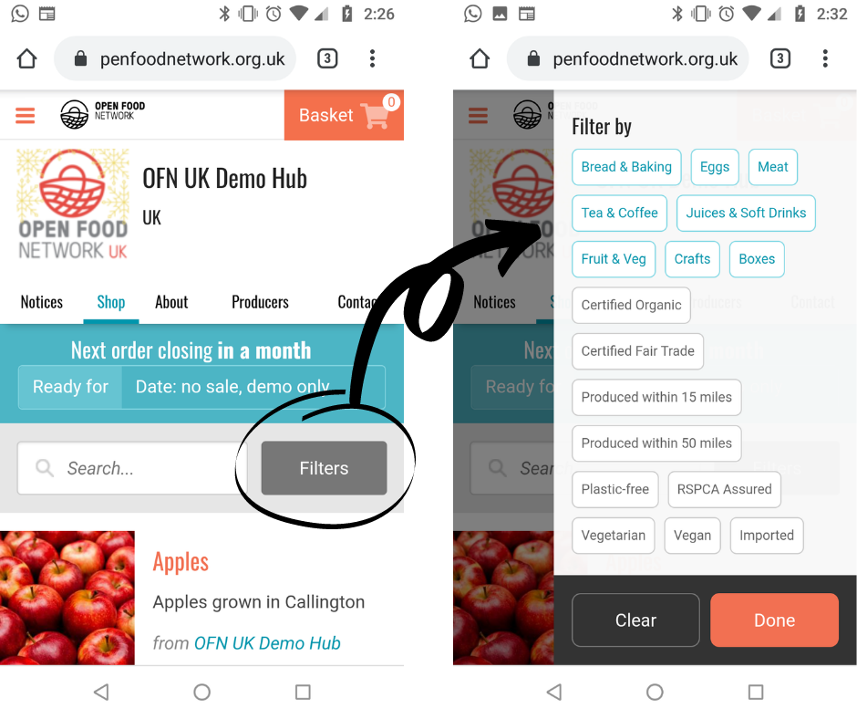
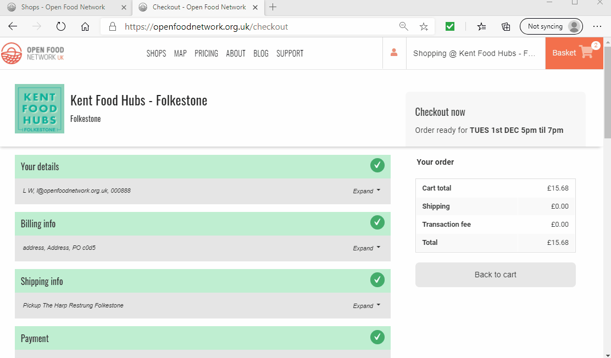

# Shopping and Placing an Order

A step-by-step guide to shopping locally including:

* Choosing [when you would like your order](shopping-and-placing-an-order.md#choosing-when-you-want-your-order)
* Tips on [how to find](shopping-and-placing-an-order.md#browse-the-shop) the products you were looking for
* From[ basket to checkout ](shopping-and-placing-an-order.md#shopping-local-made-easy)and order confirmation
* [Finding out more about your food](shopping-and-placing-an-order.md#find-out-more-about-your-food) including who made it and transparent pricing

## Choosing when you want your order

Sometimes you may find when you land on the Shop page of the business you wish to buy from it looks like this:

In the drop down red box there will be a number of options. Some shops will run separate order lists for food versus plants, others will have an order list for collection this week/month and then maybe another list for collection in a few weeks time.  In the run up to Christmas you may find your shop allows you to place an order for collection in December as well as the option to buy for collection the current week.

You can navigate between the different shopping lists available by the same box (changes to blue after you have selected an option) if you change your mind over collection date:

## **Browse the shop!**

Items may be listed grouped by category (ie. all the fruit and veg listed together and all meat items listed together) or they may just be alphabetically listed.

### **Can’t find what you are looking for?**

#### Search

You can search for items by their product name and the producer’s name (in case you know Mrs B makes amazing cakes and you want to see her whole range!).  The search box is found on the left of the screen under the menu tabs.

In this example I search for ‘carrots’:

In this example I search for all the products on offer made by Lively Foods:

#### **Filters**

A list of possible filter options are found to the right hand side of your screen on a laptop/PC or can be viewed by clicking on the grey ‘**Filters**’ button on the top right of your screen on a mobile/tablet:

You can filter products by **type** (in blue) or **property** (in black). In this example I use the filter buttons to select only those foods listed as ‘Savouries and Tasty Treats’:

In this example I use the filter buttons to find only those products listed as being ‘Certified Organic’:

## **Shopping local made easy!**

* Find the items you wish to purchase and add them to your basket using the orange ‘Add’ button.&#x20;
* As you add items to your basket you will see that the number counter in the top right hand corner increases.
* When you are ready to buy or if you would like to edit your order click on the basket icon on the top right of the screen and go to ‘Edit Basket’ or ‘Checkout’.

### **Checkout**

At checkout you will be asked to complete your address details before choosing a shipping or collection method and finally a payment method.

Address details will be automatically completed if you have an [OFN account](your-ofn-account.md) and have made a purchase in the past. You can edit any details by clicking on ‘Expand’ to the right of the menu:


A billing address is a necessary legal requirement in many countries to prove traceability of money, goods and services. Your information will be stored and used in accordance with local data protection laws.


After clicking on ‘**Place Order Now**’ you will be redirected to an order confirmation page and will receive a confirmation email.

If you have an [OFN account](your-ofn-account.md) then you can view your order at any time.

## **Find out more about your food!**

**Transparency** is a fundamental part of what the Open Food Network as an organisation believes in. We want to connect customers to their food and to the people who made it. &#x20;

Hence, when viewing a shop you can click on a _**product name to find out more about the item**_.  Information such as ingredients, allergens, how it was made and more will appear in a pop out window.

Underneath the name of a product there will be the name of the **producer**- the grower, farmer, baker, artist, cook… in blue. Clicking on this name will bring up another pop up window where _**you can read the producer’s story**_.  There are also links to their social media accounts, website and their contact details in this window.

**Next to each price is a pie chart**. This will inform you of how the money you pay as a customer for the product will be redistributed between the person who made the item and the shop who is selling it (admin fee), how much accounts for the cost of packaging or transport and how much will be reinvested in a community project (fundraising fee).

Under the price will be the **unit cost** of the product. This enables you to compare the price of products independently of packaging sizes and weights.

