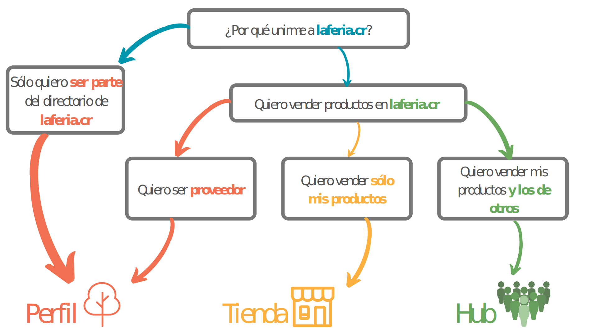

# ¿Dónde calza mi negocio en Open Food Network?

Dependiendo del tipo de empresa de alimentos que esté administrando, ppuede usar la plataforma Open Food Network de diferentes maneras.

Clasificamos las empresas de alimentos de tres formas: [Perfiles](your-quick-start-on-ofn-given-who-you-are.md#profile), [Tiendas](your-quick-start-on-ofn-given-who-you-are.md#shop) o [Hubs](your-quick-start-on-ofn-given-who-you-are.md#hub).

_La flexibilidad del software de Open Food Network le permite cambiar de perfil a tienda a hub \(y vice versa\) conforme su negocio crezca y/o necesite cambios._

## Hub


Mercado de agricultoras, esquema de cajas de vegetales, grupos de minifundistas, grupos comunitarios de comida social, cooperativas alimenticias, hubs de alimentos, CSA, jardines de mercado o ciudad, tiendas minoristas, bancos de comida, distribuidoras al por mayor...


Los hubs pueden tener muchas formas, pero en esencia, una empresa se clasifica mejor como «Hub» en Open Food Network si quieren **vender productos hechos por otras**. Se pueden vender productos propios junto a productos de granjeras, pasteleras, cultivadoras... \(un «**Hub de productoras»**\) o actuar únicamente como distribuidora y vender una colección de comestibles hechos por empresas \(locales\) \(un «**Hub de no productoras**»\).


Si prefiere vender sólo productos que **usted** hace, entonces la clasificación de «[tienda](your-quick-start-on-ofn-given-who-you-are.md#shop)» se ajusta mejor a sus necesidades.


#### Open Food Network puede ayudar a que su hub prospere de las siguientes formas:

1. Aumentando su visibilidad en línea.
2. Brindándole a sus clientes una experiencia de «mercado de agricultoras» virtual.
3. Organizando sus tareas administrativas con niveles de inventario, órdenes, finanzas, reportes de empaque, todo en un mismo lugar.
4. Habilitando las órdenes periódicas para ajustare a la oferta de temporada, rotaciones de producción y más...
5. Ayudando a organizar ordenes repetidas regulares, tales como esquemas de cajas de vegetales.
6. Ayudando a construir fuertes relaciones de trabajo con productoras locales y empresas alimenticias que brindan bienes.

_La empresa de Hub es la más flexible de los tres tipos de empresa en Open Food Network, y pueden encontrar necesario ajustar su tipo de empresa a «hub» para desbloquear algunas de las funcionalidades más complejas que ofrecemos._

**Configurar un hub en Open Food Network** puede ser tan simple como seguir 5 pasos, sólo siga nuestra guía de inicio rápido [aquí](quick-start-guides/multi-producers-shop-hub-quick-setup-guide.md).

## Tienda


Granjeras, pasteleras, cultivadoras, minifundistas individuales, empresas caseras, pequeñas agricultoras....


Las tiendas pueden tener muchas formas, pero en esencia, una empresa se clasifica mejor como «Tienda» en Open Food Network si quieren **vender** _**sólo**_ **productos** que **ustedes** hacen.


Si quieren vender productos hechos por otras además de los propios es necesario registrarse como «[Hub](your-quick-start-on-ofn-given-who-you-are.md#hub)».


Como una tienda, además de vender de forma directa a clientes a través de su escaparate, también se puede brindar sus productos a otros minoristas de Open Food Network \(Hubs\).


Si prefiere no organizar ventas a clientes de forma directa, sino sólo brindar bienes a un hub de Open Food Network, entonces la clasificación de «[Perfil](your-quick-start-on-ofn-given-who-you-are.md#profile)» se ajusta mejor a sus necesidades.


#### Open Food Network puede ayudar a que su hub prospere de las siguientes formas:

1. Aumentando su visibilidad en línea.
2. Organizando sus tareas administrativas con niveles de inventario, órdenes, finanzas, reportes de empaque, todo en un mismo lugar.
3. Habilitando las ventas de una forma que se ajuste a sus necesidades, ya sea con órdenes periódicas que calcen con una cosecha de temporada de papas, o un ciclo semanal que calce con su producciones de pasteles... ¡usted decide!
4. Ayudando a construir fuertes relaciones de trabajo con sus distribuidoras locales de comida.

**Configurar una tienda en Open Food Network** puede ser tan simple como seguir 5 pasos, sólo siga nuestra guía de inicio rápido [aquí](quick-start-guides/producer-shop-quick-setup-guide.md).

## Perfil


Granjeras, pasteleras, cosechadoras, minifundistas individuales, empresas caseras, pequeñas agricultoras...


El «Perfil» es la clasificación de empresa más básica y es ideal para micro empesas o individuos que prefieren concentrarse en cultivar, hacer, hornear y/o producir alimentos.

Un perfil de Open Food Network es ideal para **aumentar su visibilidad en línea** y da la opoprtunidad de conectarse de forma simple con minoristas locales \(hubs\) que pueden administrar las ventas a clientes por usted.


Si prefiere organizar las ventas a clientes usted misma, entonces la clasificación de «[tienda](your-quick-start-on-ofn-given-who-you-are.md#shop)» o «[Hub](your-quick-start-on-ofn-given-who-you-are.md#hub)» se ajusta mejor a sus necesidades


#### Open Food Network puede ayudar a que su hub prospere de las siguientes formas:

1. Aumentando su visibilidad en línea.
2. Ayudándole a construir fuertes relaciones de trabajo con distribuidoras locales de alimentos y minoristas \(Open Food Network hubs\) a quienes les brinda bienes.

**Configurar un perfil en Open Food Network** puede ser tan simple como seguir 4 pasos, sólo siga nuestra guía de inicio rápido [aquí](quick-start-guides/profile-only-quick-setup-guide.md).

